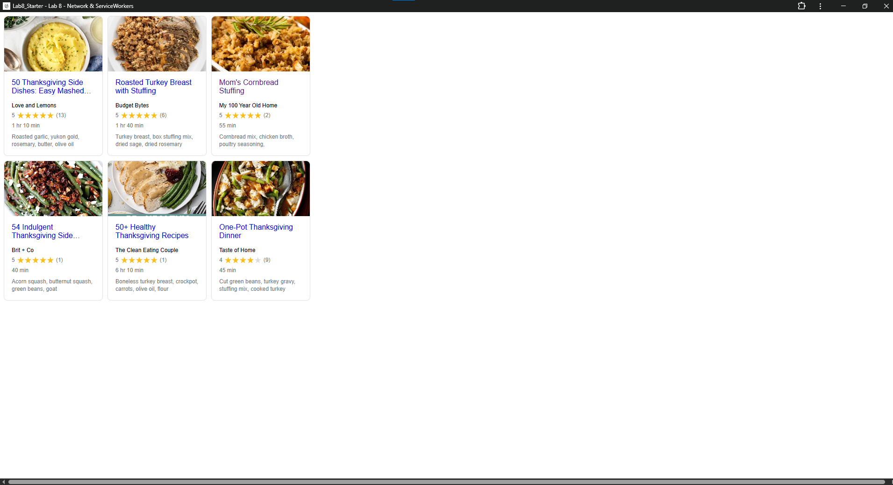

# Lab8-Starter

I worked alone so no lab partners :/

https://ggesm.github.io/Lab8_Starter/

Graceful degradation and service workers are related because service workers help your web app keep working even when the network is slow or offline. Graceful degradation means the app still works in a basic way if some features aren't available. Service workers help with this by storing important files (like HTML, CSS, and JavaScript) so users can still use the app even if they lose internet connection. 

